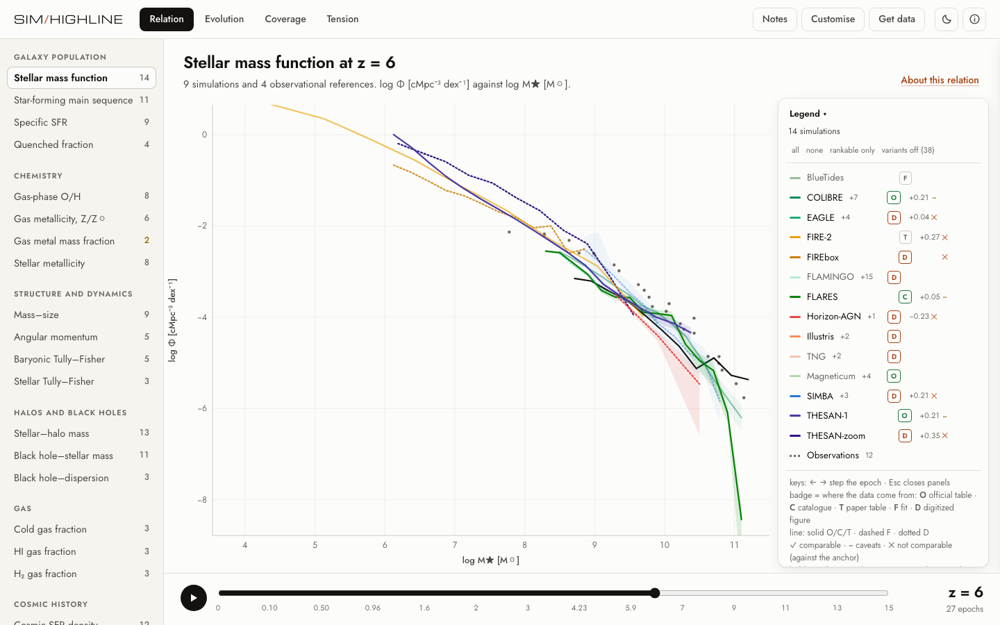

# sim-highline

[](https://doi.org/10.5281/zenodo.23217259)

<picture>
  <source media="(prefers-color-scheme: dark)" srcset="site/src/img/app-dark.png">
  
</picture>

> **Beta, not yet independently reviewed.** About half of the simulation curves (51%) were digitized from published figures by one maintainer; every record carries its source, definitions and evidence tier, but **no record has been checked by an outside expert yet**. Where an author or collaboration publishes its own table, use that. Some records come from third-party releases with their own terms (the `terms` column; `docs/SOURCE-TERMS.md`).
>
> **Corrections and takedowns:** if you are an author or data owner and want a record corrected, attributed differently or removed, open an issue (the "Curve error" form) or use the contact in `CITATION.cff`. Requests are handled promptly and removal is not contested.

**Live:** the app is at <https://shubhanbhatia42.github.io/sim-highline/highline.html>, the landing page at <https://shubhanbhatia42.github.io/sim-highline/site/index.html> and the dataset files under <https://shubhanbhatia42.github.io/sim-highline/data/export/>.

sim-highline is a researcher-facing workbench for comparing galaxy scaling relations across simulations and observational constraints. Its central rule is simple: the browser only draws ingested evidence. Missing epochs stay missing, incompatible definitions stay visible as mismatches, and no source-specific curve is synthesized from a generic template.

## Current evidence

Record, source and relation counts are generated by `scripts/report-coverage.mjs` into `data/coverage-report.json`; they are not repeated here so they cannot go stale.

Evidence enters through four routes, each labelled by tier on every record:

- Official tables with SHA-256 hashes: THESAN-1 relation files, Magneticum Box4/uhr tables, COSMOS-Web GSMF.
- Published fits and tables transcribed from the papers (`data/curves/core.json`, `literature.json`, `vanderwel14.json`): Speagle+14, Popesso+23, Baldry+12, Curti+20, Reines & Volonteri 2015, Lelli+19, Kormendy & Ho 2013, Stott+13, van der Wel+14.
- Machine-readable compilations, pinned to a commit: the SWIFT/VELOCIraptor observational comparison collection (`comparison-data.json`, also EAGLE stellar-halo and size relations) and the Sharda et al. 2026 COLIBRE MZR data release (`colibre-mzr.json`, with EAGLE, TNG50/100/300, SIMBA, FIREbox, FIRE-2 and THESAN-zoom MZRs).
- sim-highline-derived binning of individual-galaxy tables (tier `catalog-derived`, bootstrap errors, fixed seed), currently only for high-z MZR samples.

Listing a suite in the source rail does not imply that a curve has been ingested; inventory rows disappear once records exist for that relation.

## Views

- Relation: one relation at one epoch, with an explicit observational reference and pairwise definition checks.
- Residuals: model minus reference, whiskers from reported uncertainties only.
- Evidence: every source mapped for the relation, ingested or not.
- Fingerprint: every relation of one simulation at one epoch, against every matching reference; badges give the median offset over compatible references and their range.
- Atlas: offsets over relation x epoch for one simulation, or over simulation x epoch for one relation. Hatched cells mean the references disagree on the sign.
- Evolution: a relation evaluated at fixed x across all epochs each source provides.

## Expanding coverage on your machine

`data/sources-catalogue.json` lists every machine-readable product found so far with its status (`ingested`, `run-locally`, `discovered`, `request-only`). The `run-locally` adapters are tested on synthetic catalogs (`scripts/test_subfind_pipeline.py`, `scripts/test_colibre_gsmf.py`) and only need downloads or credentials that the build sandbox cannot reach.

```bash
# COLIBRE GSMF, 13 runs, z = 0-17 (Chaikin et al. 2026; public, CC-BY-4.0)
curl -o data/raw/2509.07960.yml https://colibre.strw.leidenuniv.nl/paper_data/2509.07960.yml
python3 scripts/ingest_colibre_gsmf.py data/raw/2509.07960.yml

# IllustrisTNG: fetch only the needed group-catalog fields (documented API subset endpoint, free API key)
TNG_API_KEY=... python3 scripts/fetch_tng.py TNG100-1 <root>
# (or download full group catalogs into <root>/groups_NNN/), then
python3 scripts/derive_subfind_relations.py TNG100-1 <root>
python3 scripts/derive_subfind_relations.py TNG50-1  <root50>
python3 scripts/derive_subfind_relations.py TNG300-1 <root300>

# EAGLE (free registration at virgodb.dur.ac.uk; pip install eagleSqlTools)
python3 scripts/derive_eagle_relations.py RefL0100N1504 --user <u> --password <p>

# FLAMINGO (public data release; SOAP halo catalogues, one file per snapshot)
python3 scripts/derive_soap_relations.py flamingo L1_m9 <baryon particle mass in Msun> halo_properties_*.hdf5

# Everything at once (skips any source whose credentials are not set)
TNG_API_KEY=... EAGLE_USER=... EAGLE_PASSWORD=... FLAMINGO_SOAP_DIR=... scripts/fetch_all.sh

# CAMELS or any other Subfind run
python3 scripts/derive_subfind_relations.py CAMELS-TNG-CV0 <dir> --flat --snaps 90 --source "CAMELS IllustrisTNG" --mbar <Msun> --h 0.6711 --Om 0.3
```

The Subfind and EAGLE pipelines apply identical cuts to every run (resolution limit of 100 baryon particle masses, 0.2 dex bins, at least 10 galaxies per median, sSFR > 0.2/t_age(z) for star-forming, sSFR < 1e-11 /yr for quenched). The only intended difference is the aperture: twice the stellar half-mass radius for TNG/Illustris group catalogs, 30 pkpc for EAGLE; the definition check reports it.

## Data contract

Versioned records in `data/curves/` preserve:

- exact epoch or observational redshift bin;
- native axis definitions and units;
- population and selection warnings;
- interval semantics;
- evidence tier, citation, source URL and retrieval date;
- calibration role and rankability;
- `intervalKind` for point data: `uncertainty` (enters sigma), `scatter` (population spread, never enters sigma) or `unspecified`;
- structured `definitions` (mass definition, IMF, cosmology, population, SFR timescale, tracer conventions), maintained in `scripts/definitions.mjs`.

The interface separates plotted context from rankable comparisons. Comparability is judged per pair in `compare.js`: a record-level `rankable: false` vetoes any comparison, relation-specific hard keys (e.g. IMF and density frame for the GSMF, IMF and population for the SFMS) must match, and soft keys (mass definition, cosmology, SFR timescale) are reported as caveats with their expected magnitude where known. The user selects the observational reference explicitly. Residual statistics (median offset, RMS, mean |residual|/sigma) require at least three overlapping bins; sigma combines both reported uncertainties and is omitted when either side only reports intrinsic scatter.

## Rebuild and verify

The THESAN ingester expects the four official relation files in a source directory:

```bash
node scripts/ingest-thesan.mjs /private/tmp
node scripts/ingest-magneticum.mjs /private/tmp/magneticum/data
node scripts/ingest-cosmosweb.mjs /private/tmp/cosmosweb-smf.ecsv
node scripts/validate-curves.mjs
python3 scripts/ingest_comparison_data.py /path/to/velociraptor-comparison-data   # after running its convert.sh
python3 scripts/ingest_colibre_mzr.py /path/to/colibre_mzr_sharda26
node scripts/curate-vanderwel14.mjs
node scripts/annotate-definitions.mjs
node scripts/test-curves.mjs
node scripts/test-compare.mjs
node scripts/validate-manifest.mjs
node scripts/report-coverage.mjs
node scripts/build-static.mjs
node scripts/test-static.mjs
```

`test-curves.mjs` checks more than file shape: it guards against rigid-offset redshift evolution, reversed high-redshift abundance evolution, lost source hashes, and accidental ranking of incompatible native definitions.

Build with `./scripts/verify-all.sh` (or the three scripts `build-static.mjs`, `build-highline.mjs`, `build-site.mjs`), then serve `dist/` with any static file server, for example `python3 -m http.server -d dist`. `dist/site/index.html` is the landing page and `dist/highline.html` the app; `dist/` is generated and not committed.

## Getting the data

The beta page (`dist/highline.html`) has a Get data panel that downloads exactly what is plotted, or all epochs, as tidy CSV or JSON, with a copy-ready Python snippet and BibTeX. The whole dataset is in `data/export/` (`sim-highline-records.csv`, `sim-highline-points.csv`, `sim-highline-records.json`, `sim-highline-citations.bib`, `sim-highline-manifest.json`), and `sim_highline.py` loads it:

```python
import sim_highline
df = sim_highline.load()
sel = sim_highline.select(df, relation="sfms", z=(1, 2), sources=["EAGLE", "IllustrisTNG"], rankable=True)
one = sim_highline.nearest_epoch(sel, z=1.5)        # nearest published epoch per run; nothing is interpolated
x, y, lo, hi = sim_highline.curve(df, one.record_id.iloc[0])
print(sim_highline.bibtex(sel))
```

Units are log10, physical and h-free as published; compare curves only where `x_definition`, `y_definition`, `mass_definition`, `population` and the other definition columns agree.

## Install and cite

```
pip install .            # from a checkout: installs sim_highline with the dataset bundled
```

A wheel built with `pip wheel .` contains `sim_highline.py` and the exported tables (`sim_highline_data/`), so `import sim_highline; sim_highline.load()` works from any folder. `notebooks/quickstart.ipynb` walks through loading, selecting an epoch, plotting against observations and getting BibTeX.

Code is MIT (`LICENSE`), the dataset is CC BY 4.0 (`LICENSE-DATA.md`); inputs from third-party releases keep their own terms (`docs/SOURCE-TERMS.md`). Cite the dataset (DOI [10.5281/zenodo.23217259](https://doi.org/10.5281/zenodo.23217259), always the latest version; `CITATION.cff`, or the Cite box in the beta's Get data panel) together with the original paper of every record you use.

## Embed a view

In the beta, Get data > Figure > Copy embed code gives an `<iframe>` for the current view. Any link can also be turned into an embed by adding `&embed=1` to the page link: the page then shows only the chart, legend and epoch slider with a link back to the full app.

## Contributing and checks

`.github/` holds issue forms (curve error, suggest a source), a pull request checklist and two workflows: `verify` runs `scripts/verify-all.sh` on pull requests and fails if regenerated files were not committed; `watch-arxiv` runs weekly and opens an issue listing new papers that mention a tracked simulation suite (`scripts/watch-arxiv.py`, optional `--scan` to read their captions with `scripts/scan_literature.py`). See `CONTRIBUTING.md`.

## More

`docs/REVIEW.md` (a candid assessment: who would use this, what it is not), `docs/METHODS.md` (how values get in and what they may mean), `docs/DATA-CARD.md`, `docs/expert-audit-sample.md`, `CHANGELOG.md`, `CITATION.cff`. Verify everything with `./scripts/verify-all.sh`; `python3 scripts/regress_digitizers.py` regenerates every digitized record from its source and diffs against the shipped data.
